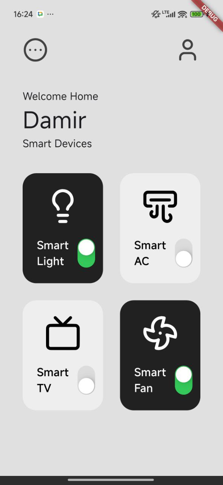

# Smart Home Control App

A modern Flutter application for controlling smart home devices with an intuitive and clean interface.



## Features

- **Device Control**: Toggle smart devices on/off with interactive switches
- **Real-time Status**: Visual feedback showing device power states
- **Device Types Supported**:
  - Smart Lights
  - Smart AC
  - Smart TV
  - Smart Fan
- **Clean UI**: Modern design with dark/light device cards based on power state

## Tech Stack

- **Flutter**: Cross-platform mobile framework
- **Dart**: Programming language
- **Lucide Icons**: Beautiful icon set for device representations

## Getting Started

1. Ensure Flutter is installed on your machine
2. Clone this repository
3. Run `flutter pub get` to install dependencies
4. Run `flutter run` to start the application

## Project Structure

```
lib/
├── main.dart           # App entry point
├── pages/
│   └── home_page.dart  # Main home screen with device grid
└── util/
    └── smart_device_box.dart  # Reusable smart device card widget
```
